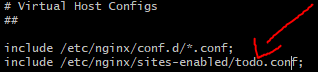

## EC2 배포

### 1. AWS EC2 생성

- AWS 서비스의 EC2 클릭 후 인스턴스 시작을 눌러 EC2 인스턴스 생성
- Amazon Machine Image 선택 -> Ubuntu 선택
- 인스턴스 유형 선택 -> 프리티어 이용을 위한 t2.micro 선택 후 검토 및 시작 클릭
- 인스턴스 유형 및 AMI 확인 후 시작하기 클릭
- 키 페어 이름 등록 및 다운로드 후 인스턴스 시작 클릭
- 인스턴스 목록에서 실행중인 인스턴스 확인 가능

### 2. EC2 원격 접속 (SSH를 이용한 원격 접속)

- pem 키가 저장된 경로에서 터미널 실행

- .pem 파일에 대한 권한 설정

  ```
  chmod 400 <pem키 이름>.pem
  ssh -i "<pem키 이름>.pem" ubuntu@<퍼블릭 IPv4 주소 OR 퍼블릭 IPv4 DNS>
  ```

### 3. EC2 웹서버 배포 (express로 웹서버 구동에 필요한 설치들)

- 운영체제에서 사용 가능한 패키지와 버전에 대한 정보 업데이트

  ```
  sudo apt-get update
  ```

- node 에러 방지

  ```
  sudo apt-get install -y build-essential
  ```

- nodejs 설치

  ```
   sudo apt-get install nodejs
  ```

- npm 설치

  ```
   sudo apt install npm
  ```

- nvm 설치
  ○ https://github.com/nvm-sh/nvm#installing-and-updating 링크 참고

  ```
  curl -o- https://raw.githubusercontent.com/nvm-sh/nvm/v0.34.0/install.sh | bash
  . ~/.nvm/nvm.sh
  nvm --version
  ```

- node 설치

  ```
  nvm install v<사용할 버전 번호>
  node --version
  ```

- git 설치

  ```
  sudo apt-get install git
  git --version
  ```

- nginx 설치

  ```
  sudo apt-get install nginx
  ```

- nginx 테스트

  ```
  systemctl start nginx
  ```

- 레포지토리 클론

  ```
  git clone <레포지토리 주소>
  ```

- git에 접근하기 위한 로그인 정보를 git credential에 입력하고 store에 저장

  ```
  cd <서버 디렉토리>
  git config --global credential.helper store
  ```

  - 위 명령어 실행 후 pull 진행 시 한번 입력된 로그인 정보는 디스크에 남아있게 됨

- 프로젝트 실행

  ```
  npm install
  npm start
  ```

- 포트 설정
  ○ 네트워크 및 보안 탭 -> 보안 그룹 클릭
  ○ 인바운드 규칙 편집 클릭
  ○ HTTP는 기본적으로 80, HTTPS는 기본적으로 443, 사용자 지정TCP에 사용할 포트 설정

- http://<아이피 주소:포트넘버 OR DNS:포트넘버> 접속 후 확인

### 4. 포트 Redirect

- 포트를 지정하지 않고 URL로 접속 시 default인 80포트로 접속하게 된다

- 80포트로 접속했을 때 웹 서버의 포트로 Redirect하게 한다면 포트를 명시하지 않고 접속할 수 있다

  ```
  sudo iptables -A PREROUTING -t nat -i eth0 -p tcp --dport 80 -j REDIRECT --to-port <포트 번호>
  ```

- Redirect 포트 리스트 확인 명령어

  ```
  sudo iptables -t nat -L --line-numbers
  ```

- Redirect 포트 삭제 삭제 명령어

  ```
  sudo iptables -t nat -D PREROUTING <포트 리스트에서 확인한 num 항목의 값>
  ```

### 5. pm2 설정

```
Package.json 수정 => start: "pm2 start <<실행할 파일>>"
npx pm2 list => pm2의 리스트를 보여줌
npx pm2 monit => 모니터링 기능
npx pm2 kill => pm2 종료
npx pm2 start <<실행 파일>> => 실행파일 실행
```

- pm2를 통해 다른 명령어를 포함해 실행

```
npx pm2 start npm -- start (package.json의 script 중 start 명령어 실행)
```

- 배포시에는 .env등 배포용으로 따로 세팅해주자

### 6. nginx 명령어

- 설치 : sudo apt install nginx
- 시작 : sudo service nginx start
- 중지 : sudo service nginx stop
- 재시작 : sudo service nginx restart
- 상태 확인 : sudo service nginx status
- 기본 설정 제거

```
sudo rm /etc/nginx/sites-available/default
sudo rm /etc/nginx/sites-enabled/default
```

- 설정 파일 변경
  ○ cd /etc/nginx/sites-available
  ○ sudo touch myapp.conf
  ○ sudo vi myapp.conf
  ○ 아래와 같이 설정 추가 => root 설정은 build 파일의 경로로 수정

```
server {
  listen 80;
  location / {
    root   /home/ubuntu/myapp/build;
    index  index.html index.htm;
    try_files $uri $uri/ /index.html;
  }
}
```

○ 아래 명령어를 통해 파일의 심볼릭 링크를 /etc/nginx/sites-enabled 에도 생성

```
sudo ln -s /etc/nginx/sites-available/myapp.conf /etc/nginx/sites-enabled/myapp.conf
sudo vi /etc/nginx/nginx.conf 설정을 아래 부분을 <<app 이름>>.conf 로 변경한다
```




- 참고 블로그
  ○ https://ookm1020.tistory.com/4?category=858485
  ○ https://darrengwon.tistory.com/546
  ○ https://medium.com/@bdv111/aws-ec2%EC%97%90%EC%84%9C-nginx%EB%A1%9C-react-%EC%95%B1-%EC%A7%81%EC%A0%91-%EB%B0%B0%ED%8F%AC%ED%95%98%EA%B8%B0-c1e09639171e
  ○ https://velog.io/@mingtorr/AWS-EC2%EB%A1%9C-%ED%99%88%ED%8E%98%EC%9D%B4%EC%A7%80-%EB%B0%B0%ED%8F%AC%ED%95%98%EA%B8%B04-nginxreact-%EC%97%B0%EA%B2%B0%ED%95%98%EA%B8%B0
  ○ https://codechacha.com/ko/deploy-react-with-nginx/
  ○ https://velog.io/@tunakim/AWS-EC2-Nginx-%EC%9D%B4%EC%9A%A9%ED%95%B4-React-%ED%94%84%EB%A1%9C%EC%A0%9D%ED%8A%B8-%EB%B0%B0%ED%8F%AC
